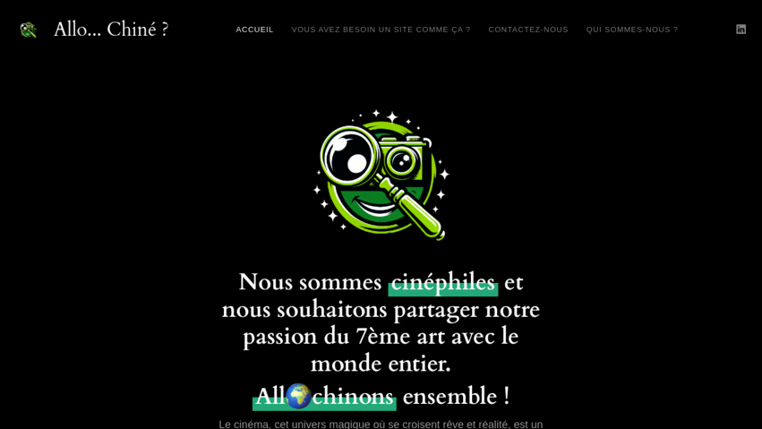
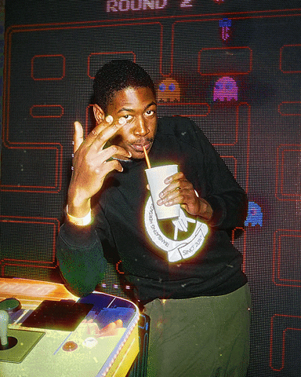
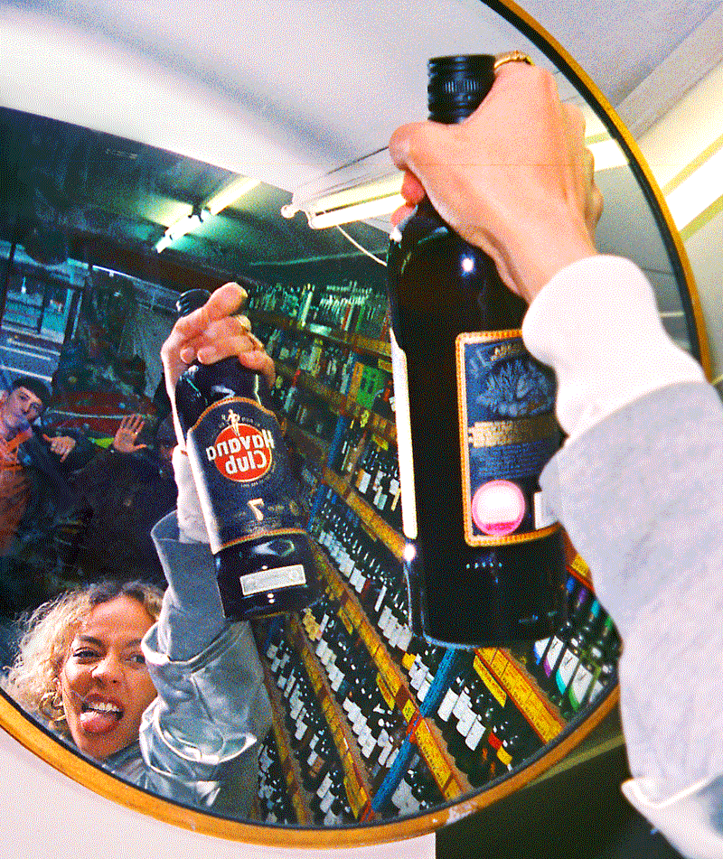
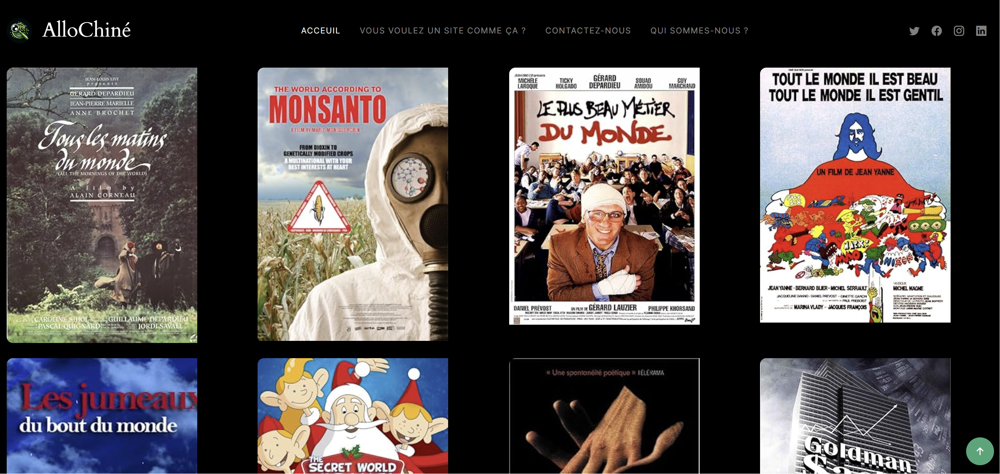
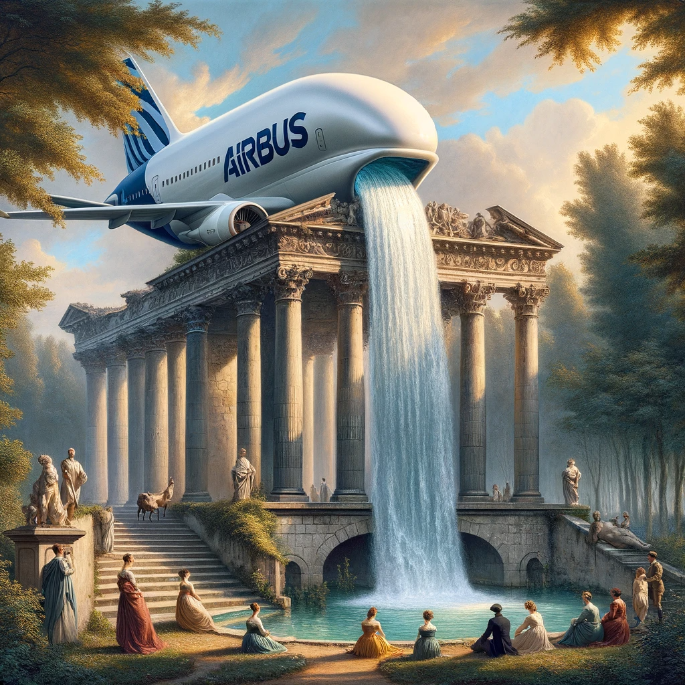
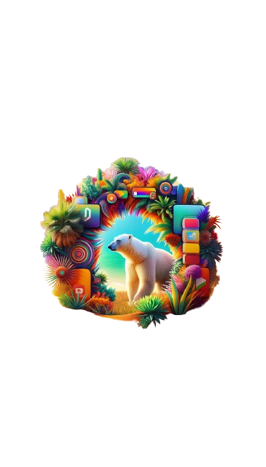

# Allo... Chiné ?

Un générateur de films et de séries aléatoires pour pimenter vos soirées Netflix, bloqué dans la boucle des recommandations répétitives !

---

# Où dans le WWW (World Wide Web) ?

- Version finale (en ligne ?) :
  

- Tracker de statut :
   ✅

# Redécouvrez la magie du cinéma avec AlloChiné

## Introduction

Êtes-vous un cinéphile fatigué de défiler sans fin à travers les services de streaming traditionnels, pour ne trouver que des choix prévisibles ? Il est temps de vous libérer du banal et de plonger dans le monde captivant du vrai cinéma. Notre moteur de recherche de base de données de films est conçu pour ceux qui chérissent l'art du cinéma et recherchent une expérience cinématographique plus profonde et significative. Préparez-vous à embarquer dans un voyage à travers un trésor de films qui vont au-delà du grand public, apportant l'essence de diverses époques à portée de main.

## Nostalgie du cinéma authentique

Dans une ère où l'industrie cinématographique est dominée par les blockbusters et les franchises, notre plateforme se veut un sanctuaire pour ceux qui se languissent de la richesse et de la profondeur du cinéma d'antan. Nous célébrons les classiques intemporels, les films qui ont ému les cœurs et stimulé les esprits, créant des moments inoubliables. Ces chefs-d'œuvre du passé ne sont pas seulement des films ; ce sont des fenêtres sur des mondes perdus, des invitations à explorer des époques et des cultures à travers les yeux des plus grands cinéastes.

## Notre vision : un horizon sans limites pour les cinéphiles

Notre moteur de recherche est plus qu'un simple outil ; c'est une porte ouverte sur un univers cinématographique sans frontières. Nous croyons en un monde où chaque film, qu'il soit un chef-d'œuvre méconnu ou un succès culte, a sa place et sa valeur. Notre mission est de connecter chaque cinéphile avec des films qui résonnent, qui inspirent, qui éveillent la curiosité. Des films qui ne sont pas seulement regardés, mais vécus et ressentis, créant ainsi des liens inédits entre le passé, le présent et l'avenir du cinéma.

## Un voyage à travers le temps et l'espace cinématographiques

Avec notre plateforme, préparez-vous à un voyage cinématographique inégalé. De la splendeur du cinéma muet aux dernières innovations numériques, de Hollywood à Bollywood, des ruelles de Paris aux déserts de l'Afghanistan, nous vous offrons un billet pour explorer le monde à travers le prisme du 7ème art. Chaque recherche est une opportunité de découvrir un nouveau joyau, une histoire jamais racontée, un regard différent sur la vie et sur le monde.

## L'expérience utilisateur : naviguer dans l'univers du cinéma

Naviguer sur notre plateforme, c'est comme se promener dans les allées d'une bibliothèque infinie dédiée au cinéma. Intuitive et conviviale, notre interface vous guide vers des découvertes surprenantes et des retrouvailles attendues. Que vous recherchiez un film spécifique ou que vous souhaitiez vous laisser surprendre, notre moteur de recherche est votre complice dans cette aventure cinématographique. La facilité de recherche et les suggestions personnalisées vous permettent de composer votre propre mosaïque cinématographique, reflétant vos goûts uniques.

## Communauté et passion partagée

Chez nous, chaque utilisateur est un membre d'une communauté mondiale de cinéphiles. Partagez vos critiques, vos découvertes, vos coups de cœur et engagez-vous dans des discussions enrichissantes avec des passionnés du monde entier. Notre plateforme est un lieu de rencontre pour échanger, apprendre et célébrer ensemble la diversité et la richesse du cinéma.

## Appel à l'action : rejoignez la révolution cinématographique

Votre quête du film parfait commence ici. Rejoignez notre communauté de passionnés et découvrez le cinéma sous un jour nouveau. Parce que chaque film a une histoire, et chaque histoire mérite d'être racontée. Explorez, expérimentez, partagez - ensemble, redéfinissons l'expérience cinématographique.

# SEE IT ? CLICK IT !

  

    

      <h2>Version finale (le projet)</h2>
      
    

    

      <h2>Version bêta en ligne :</h2>
      
    

    <h1>une GALERiE:LA_GALERiE ici!</h1>
    

      <h2>MAGHREB UNITED </h2>
      
    

  

  

    

      <h2>Je monte dans les tours comme Jul.</h2>
      
    

    

      <h2>MATRiCULE: 555.</h2>
      
    

    

      <h2>Dignity.</h2>
      
    

  

  

    

      <h2>a$ap RoCK iT:!</h2>
      
    

  

  

    <h2>Brothers</h2>
    
  

  

    <h2>Dignity.</h2>
    
  

  

    <h2>DaTPaRTii Cartillé</h2>
    
  

  

    <h2>DaTMooD</h2>
    
  

  

    <h2>Stan Smith.</h2>
    
  

      

      <h2>Allo.. Chiné ?</h2>
      
    

  

    <h2>Alors.. Chiné !</h2>
    
  

  

          <h2>Enjoy, it's art!</h2>
    
        <h2>Hi! 👋 I am a licensed & certified French Web Dev! 🪂</h2>
    
  

  <blockquote>Toutes les grandes réalisations prennent du temps.</bloquote>
  
- Maya Angelou
